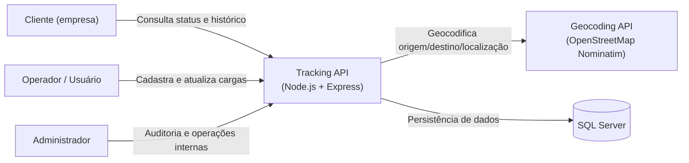

# C4 — Nível 1: Contexto (System Context)

Este diagrama mostra **quem usa** o sistema e **quais sistemas externos** ele integra.

## Notas

- O **Geocoding API** é um sistema externo usado para obter **latitude/longitude** a partir de endereços/locais em texto.
- O **SQL Server** armazena clientes, operadores, viagens/cargas e histórico de movimentações.
