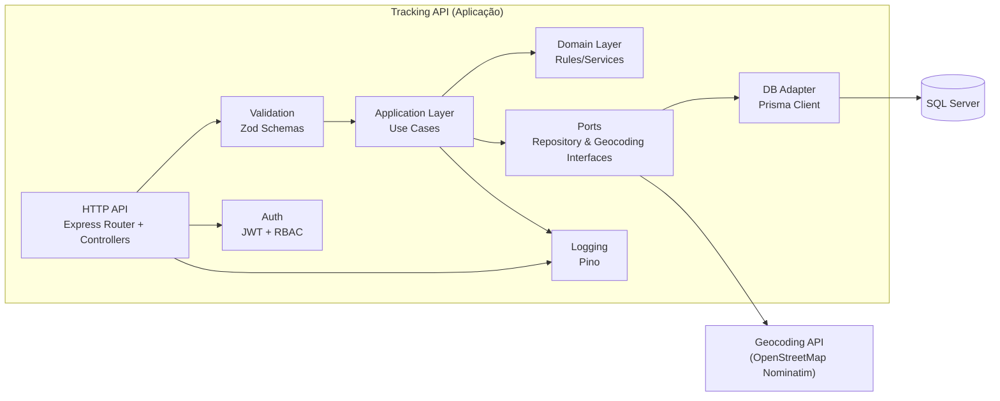

# C4 — Nível 2: Containers

Este diagrama mostra os principais **containers/blocos executáveis** e como se comunicam.

## Notas

- **Container** aqui é o executável principal (a API). As caixas internas representam componentes relevantes, mas sem detalhar a estrutura de código.
- A camada de aplicação depende de **ports** (interfaces) e não de implementações (Prisma/HTTP).
