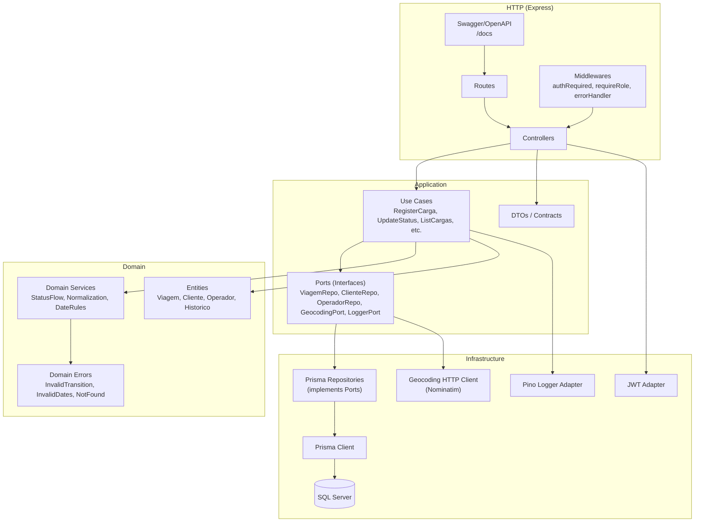

# C4 — Nível 3: Componentes (Component)

Este diagrama detalha os componentes internos da API e o fluxo de dependências (Clean Architecture).

## Regras de dependência

- `domain` **não depende** de Express/Prisma.
- `application` depende de `domain` e **ports**.
- `infrastructure` implementa as **ports** (Prisma, HTTP, JWT, logs).
