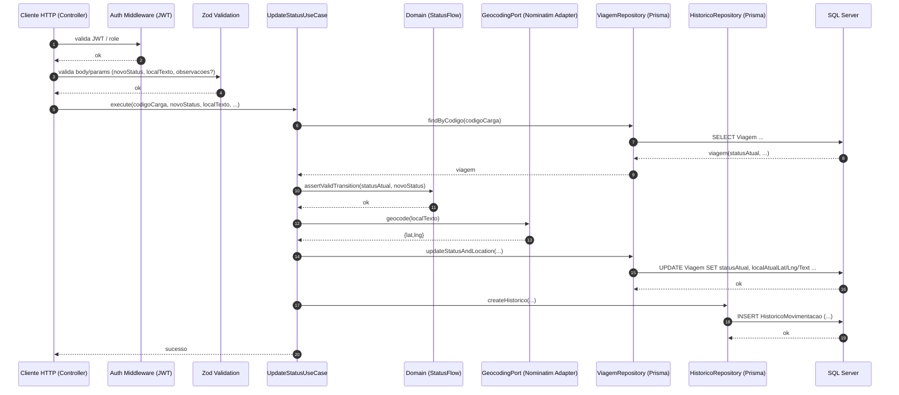

# C4 — Nível 4: Dinâmica (Dynamic)

Cenário: **PUT /tracking/{codigoCarga}/status**  
Objetivo: atualizar status + localização atual e **registrar automaticamente** no histórico.

## Invariantes garantidos
- Transição inválida é bloqueada (ex.: **ENTREGUE -> EM_TRANSITO**).
- Cada atualização de status gera um registro em `HistoricoMovimentacao` automaticamente.
