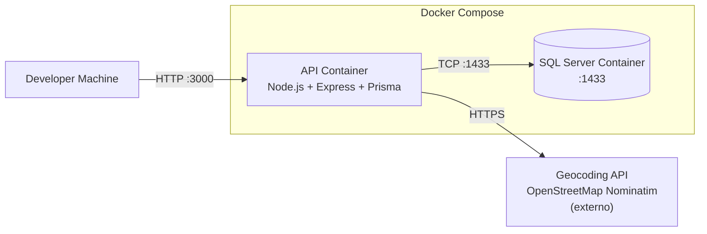

# C4 — Deployment (Ambiente Local com Docker)

Este diagrama descreve o ambiente de execução local recomendado para desenvolvimento e demonstração.

## Notas

- O SQL Server roda em container via `docker-compose.yml`.
- A API pode rodar localmente (node) ou em container (opcional). Para o teste, basta rodar local e apontar para o DB do compose.
