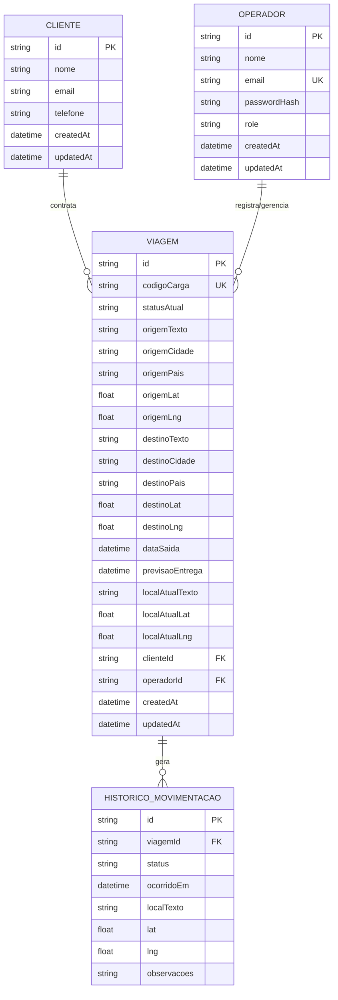

# DER — Modelo Relacional (SQL Server)

## Índices recomendados
- `VIAGEM(codigoCarga)` UNIQUE
- `VIAGEM(statusAtual)`, `VIAGEM(clienteId)`, `VIAGEM(operadorId)`, `VIAGEM(dataSaida)`
- `HISTORICO_MOVIMENTACAO(viagemId, ocorridoEm)` para ordenação por histórico
