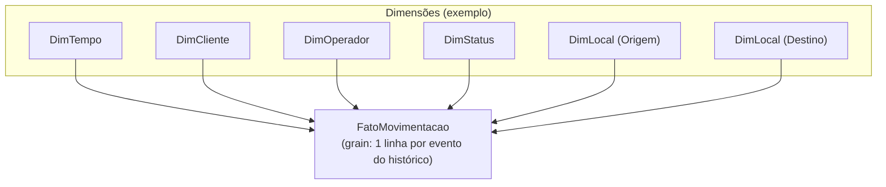

# (Opcional) Modelo Analítico — Tabela Fato para BI/Analytics

Objetivo: suportar análises de **SLA**, **atrasos**, **tempo por status**, **performance por rota/cliente**.

## FatoMovimentacao (exemplo de colunas)

- `movimentacaoId` (degenerate / referência ao evento)
- `dataKey`, `clienteKey`, `operadorKey`, `statusKey`, `origemKey`, `destinoKey`
- Medidas:
  - `leadTimeMinutos` (do embarque até entrega, quando aplicável)
  - `atrasoMinutos` (diferença entre previsaoEntrega e entrega real)
  - `tempoNoStatusMinutos` (tempo até o próximo evento)

## Justificativa

- Permite agregações por período, cliente, operador, rota e status sem afetar o OLTP.
